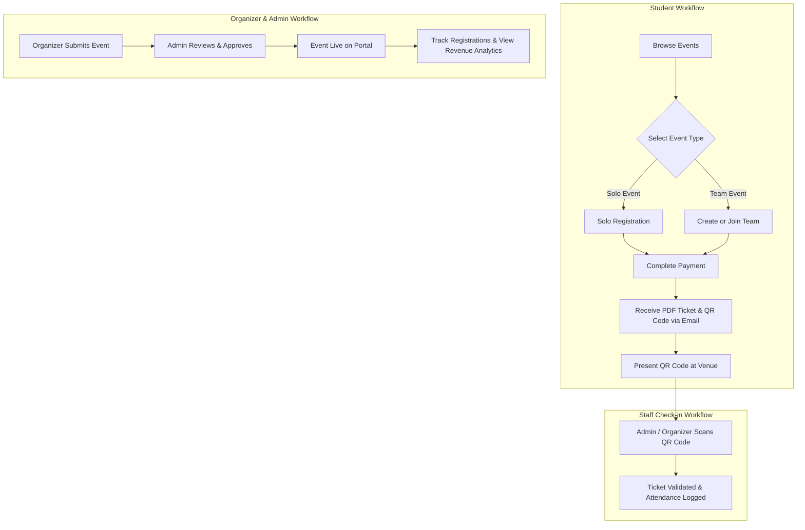

# 🎟️ Eventix - Event Management & Automated Ticketing Platform

**Eventix** is a full-stack, multi-role event management, ticketing, and attendance system designed for universities, colleges, and event organizations. It seamlessly bridges event discovery, team formation, automated PDF ticket generation with unique QR codes, real-time ticket scanning, payment analytics, and administrator approval workflows.

---

## ✨ Key Features

### 👤 Multi-Role Portal System
- **Student / Attendee**: Discover events, register as an individual or team leader/member, download e-tickets, and view registration history.
- **Event Organizer**: Register accounts (subject to admin approval), create detailed event listings with posters, track registrations, and monitor check-ins.
- **System Administrator**: Manage organizers, review and approve/reject event submissions, inspect payments & revenue analytics, manage global events, and verify tickets.

### 📅 Event Management & Discovery
- Category-based event classification (*Technical, Cultural, Sports, Workshops*).
- Cloudinary integration for high-definition event poster & banner uploads.
- Real-time seat tracking and capacity enforcement.
- Rich event details including price, venue, schedule, rules, and contact details.

### 👥 Solo & Team Registrations
- Flexible registration flows supporting both solo attendees and group teams.
- Unique Team Code generation for group leaders to invite team members.
- Team member validation and maximum team size constraints.

### 💳 Payment Processing & Revenue Analytics
- Simulated payment checkout workflow recording transaction history.
- Automated payment status updates upon successful transaction.
- Comprehensive financial dashboard displaying total revenue, average transaction amounts, and per-event financial breakdowns.

### 🎟️ Automated E-Tickets & QR Code Engine
- On-the-fly PDF ticket generation featuring custom event branding.
- Embedded high-resolution QR codes containing secure encrypted registration payload data.
- Automated email dispatch of PDF tickets directly to attendee inboxes via SMTP.

### 📱 Live QR Code Attendance & Ticket Verification
- In-browser camera QR Code Scanner for event staff.
- Instant ticket validation (prevents duplicate entry attempts).
- Real-time attendance logging with timestamps.

---

## 🛠️ Tech Stack

### **Frontend**
- **Core**: HTML5, JavaScript (ES6+ Native Fetch API)
- **Styling**: Vanilla CSS3 (Custom Glassmorphism UI, Responsive CSS Grid & Flexbox)
- **Libraries**: `html5-qrcode` / QR code rendering libraries

### **Backend**
- **Runtime**: Node.js
- **Framework**: Express.js (v5)
- **Database**: MongoDB with Mongoose ODM
- **Authentication**: Bcrypt password hashing & session control

### **Third-Party Integrations & Utilities**
- **Cloud Storage**: Cloudinary & `multer-storage-cloudinary` (Image hosting)
- **Document Generation**: `pdfkit` (Dynamic PDF ticket creation)
- **QR Code Engine**: `qrcode`
- **Email Dispatch**: `nodemailer` (SMTP Emailing)

---

## 📁 Repository Structure

```
Eventix/
├── backend/
│   ├── config/
│   │   ├── cloudinary.js      # Cloudinary service setup
│   │   └── db.js              # MongoDB database connection
│   ├── controllers/
│   │   ├── adminController.js         # System admin operations
│   │   ├── attendanceController.js    # QR verification & check-ins
│   │   ├── authController.js          # Authentication logic
│   │   ├── eventController.js         # Event CRUD operations
│   │   ├── organizerController.js     # Organizer approvals & management
│   │   ├── paymentController.js       # Transactions & analytics
│   │   ├── registrationController.js  # Solo & team registrations
│   │   ├── teamController.js          # Team creation & member management
│   │   └── ticketController.js        # PDF generation & email dispatch
│   ├── middleware/
│   │   └── authMiddleware.js   # Authorization middlewares
│   ├── models/
│   │   ├── Attendance.js      # Attendance records schema
│   │   ├── Event.js           # Event schema
│   │   ├── Payment.js         # Transactions schema
│   │   ├── Registration.js    # Event registrations schema
│   │   ├── Team.js            # Team data schema
│   │   └── User.js            # User & credentials schema
│   ├── routes/                # Express API route modules
│   ├── utils/                 # Helper utilities (PDF, QR, Email, Uploads)
│   ├── .env.example           # Environment template
│   ├── package.json           # Node.js dependencies & scripts
│   └── server.js              # Express server entry point
├── frontend/
│   ├── css/
│   │   └── style.css          # Core design system & glassmorphism styles
│   ├── js/
│   │   ├── auth.js            # Frontend auth handlers
│   │   ├── events.js          # Event browsing & rendering logic
│   │   └── registration.js    # Registration modal & checkout flow
│   ├── index.html             # Main landing page & event discovery
│   ├── events.html            # All events catalogue
│   ├── login.html             # User login page
│   ├── signup.html            # User signup page
│   ├── login-organizer.html   # Organizer portal login
│   ├── signup-organizer.html  # Organizer registration page
│   ├── login-admin.html       # Admin portal login
│   ├── admin-dashboard.html   # System admin control center
│   ├── admin-manage-events.html # Admin event moderation
│   ├── admin-payments.html    # Financial analytics dashboard
│   ├── admin-scanner.html     # Admin ticket scanner
│   ├── organizer-dashboard.html # Organizer workspace
│   ├── my-events.html         # User registered events & tickets
│   └── team.html              # Team workspace & member management
├── .gitignore                 # Git ignore rules
└── README.md                  # Project documentation
```

---

## 🚀 Getting Started

### Prerequisites
- [Node.js](https://nodejs.org/) (v18 or higher recommended)
- [MongoDB](https://www.mongodb.com/) (Local instance or MongoDB Atlas connection string)
- [Cloudinary Account](https://cloudinary.com/) (For image upload support)
- Gmail / SMTP credentials for sending ticket emails

---

### 1. Installation

Clone the repository and navigate into the `backend` directory:

```bash
git clone https://github.com/BIKRAM-GORAI/Eventix.git
cd Eventix/backend
```

Install backend dependencies:

```bash
npm install
```

---

### 2. Environment Configuration

Create a `.env` file in the `backend/` directory based on `.env.example`:

```bash
cp .env.example .env
```

Configure your environment variables in `backend/.env`:

```env
# Server Configuration
PORT=5000
NODE_ENV=development

# Database Connection
MONGO_URI=mongodb+srv://<username>:<password>@cluster.mongodb.net/eventix?retryWrites=true&w=majority

# Cloudinary Storage
CLOUDINARY_CLOUD_NAME=your_cloudinary_cloud_name
CLOUDINARY_API_KEY=your_cloudinary_api_key
CLOUDINARY_API_SECRET=your_cloudinary_api_secret

# Email Service (Gmail App Password)
EMAIL_USER=your_email@gmail.com
EMAIL_PASS=your_gmail_app_password

# Admin Credentials
ADMIN_EMAIL=admin@college.edu
ADMIN_PASS=admin123
```

---

### 3. Running the Application

#### Option A: Running from Root Directory (`Eventix/`)

You can run the application directly from the project root:

```bash
# Start backend server in development mode (with auto-reload)
npm run dev

# OR start in production mode
npm start
```

#### Option B: Running from Backend Directory (`Eventix/backend/`)

Alternatively, navigate into the `backend/` folder:

```bash
cd backend

# Start development server
npm run dev

# OR start production server
npm start
```

---

### 4. Accessing Frontend & Backend

1. **Backend API Server**: Runs at **`http://localhost:5000`**
2. **Frontend Application**:
   - **Option 1 (Direct)**: Open [`frontend/index.html`](file:///c:/Desktop/Eventix/frontend/index.html) directly in your web browser.
   - **Option 2 (VS Code Live Server)**: Right-click `frontend/index.html` in VS Code and select **"Open with Live Server"**.
   - **Option 3 (HTTP Server)**: Serve static files using `npx`:
     ```bash
     npx serve frontend
     ```

3. **Backend Status**: The server will start on `http://localhost:5000` (or your configured `PORT`).

#### Launch Frontend:
Since the frontend consists of static HTML, CSS, and JS files, you can open `frontend/index.html` directly in your browser or serve it using any HTTP server (such as Live Server in VS Code, `npx serve frontend`, or Python `http.server`).

---

## 📡 REST API Reference

### 🔐 Authentication (`/api/auth`)
| Method | Endpoint | Description |
| :--- | :--- | :--- |
| `POST` | `/api/auth/register` | Register a new student/user account |
| `POST` | `/api/auth/login` | Login user and retrieve session token |

---

### 📅 Events (`/api/events`)
| Method | Endpoint | Description |
| :--- | :--- | :--- |
| `GET` | `/api/events` | Fetch all approved & active events |
| `GET` | `/api/events/:id` | Get detailed information for a specific event |
| `POST` | `/api/events` | Create a new event (organizer/admin) |
| `PUT` | `/api/events/:id` | Update an existing event |
| `DELETE` | `/api/events/:id` | Delete an event |

---

### 📝 Registrations & Teams (`/api/registration`, `/api/team`)
| Method | Endpoint | Description |
| :--- | :--- | :--- |
| `POST` | `/api/registration/solo` | Register for an event as an individual |
| `POST` | `/api/team/create` | Create a new team for a group event |
| `POST` | `/api/team/join` | Join an existing team using a team code |
| `GET` | `/api/registration/user/:userId` | Fetch all event registrations for a user |

---

### 💳 Payments & Analytics (`/api/payment`)
| Method | Endpoint | Description |
| :--- | :--- | :--- |
| `POST` | `/api/payment/process` | Process & record event payment transaction |
| `GET` | `/api/payment/analytics` | Retrieve revenue overview & event payment breakdown |
| `GET` | `/api/payment/event/:eventId` | Fetch transactions for a specific event |

---

### 🎟️ Tickets & Attendance (`/api/ticket`, `/api/attendance`)
| Method | Endpoint | Description |
| :--- | :--- | :--- |
| `GET` | `/api/ticket/download/:registrationId` | Generate & download PDF E-Ticket |
| `POST` | `/api/ticket/send-email` | Email PDF ticket with QR code to attendee |
| `POST` | `/api/attendance/scan` | Scan QR code & record attendee check-in |
| `GET` | `/api/attendance/event/:eventId` | View event attendance stats & logs |

---

### ⚙️ Admin & Organizer Management (`/api/admin`, `/api/organizer`)
| Method | Endpoint | Description |
| :--- | :--- | :--- |
| `GET` | `/api/admin/pending-organizers` | List pending organizer approval requests |
| `PUT` | `/api/admin/approve-organizer/:id` | Approve or reject an organizer application |
| `PUT` | `/api/admin/approve-event/:id` | Approve or reject submitted events |
| `GET` | `/api/admin/analytics` | Get global system performance metrics |

---

## 👥 Roles & Workflows



---

## 🌐 Deploying on Vercel

The project includes a pre-configured [`vercel.json`](file:///c:/Desktop/Eventix/vercel.json) file that maps:
- `frontend/index.html` as the main landing page (`/`).
- `frontend/` static assets (`/css/*`, `/js/*`, `*.html`).
- `backend/server.js` Express API server under `/api/*`.

### Steps to Deploy:
1. Push your repository to GitHub.
2. Import the repository into [Vercel](https://vercel.com).
3. In Vercel Project Settings, add your Environment Variables under **Environment Variables** (matching your `.env` file):
   - `MONGO_URI`
   - `CLOUDINARY_CLOUD_NAME`
   - `CLOUDINARY_API_KEY`
   - `CLOUDINARY_API_SECRET`
   - `EMAIL_USER`
   - `EMAIL_PASS`
4. Click **Deploy**. Vercel will automatically detect `vercel.json`, serve `index.html` as the root page, and run the Express API endpoints as Serverless Functions.

---

## 📄 License

Distributed under the **ISC License**. See `LICENSE` for more information.
